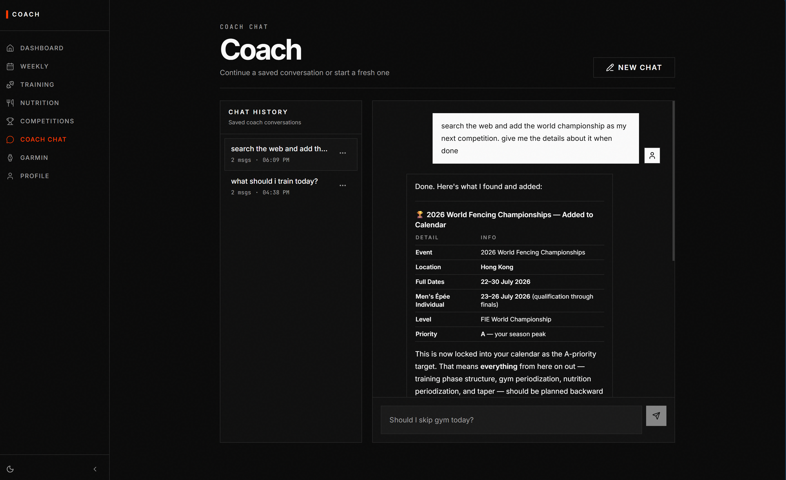
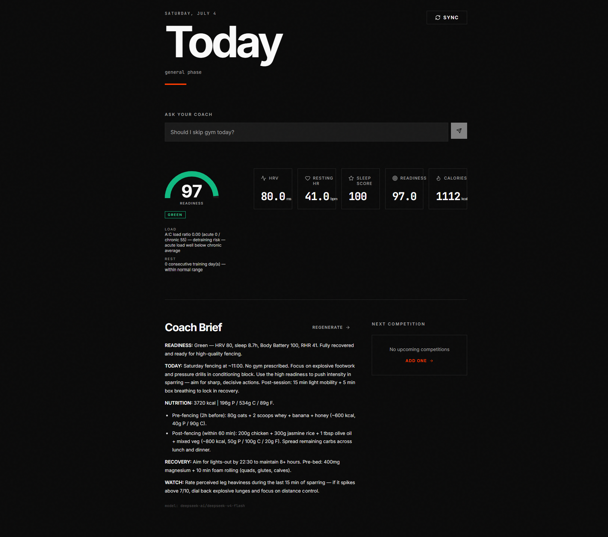
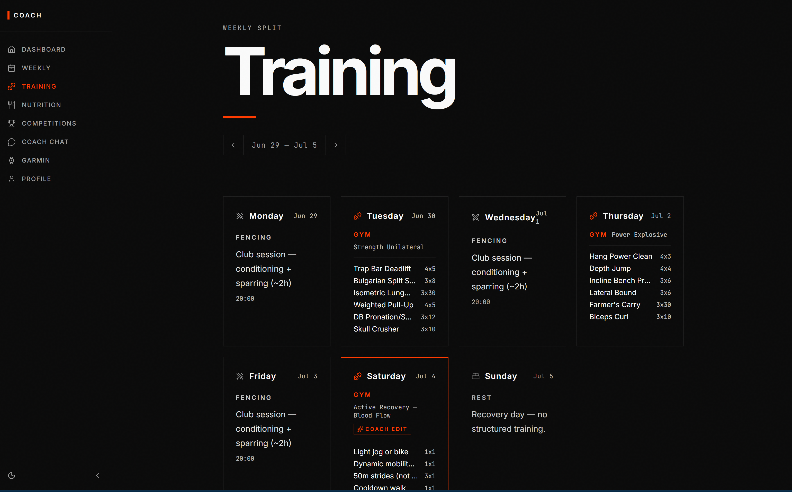
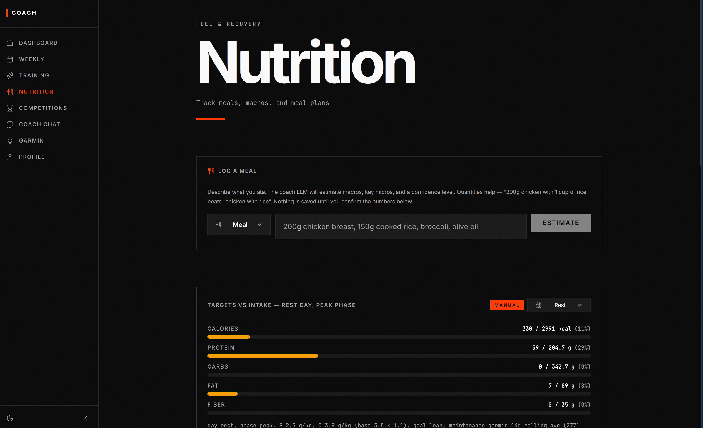
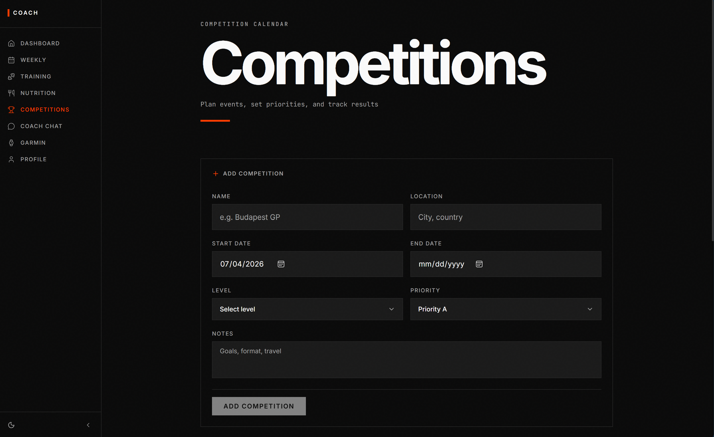
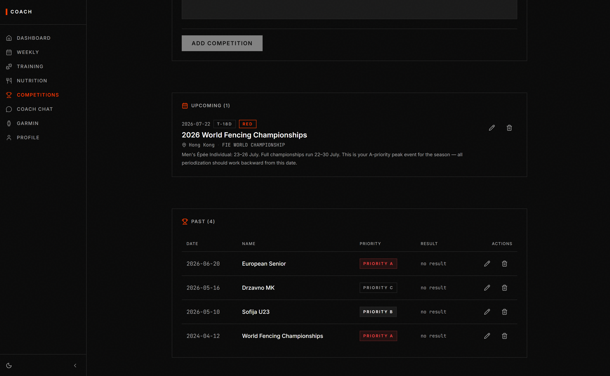
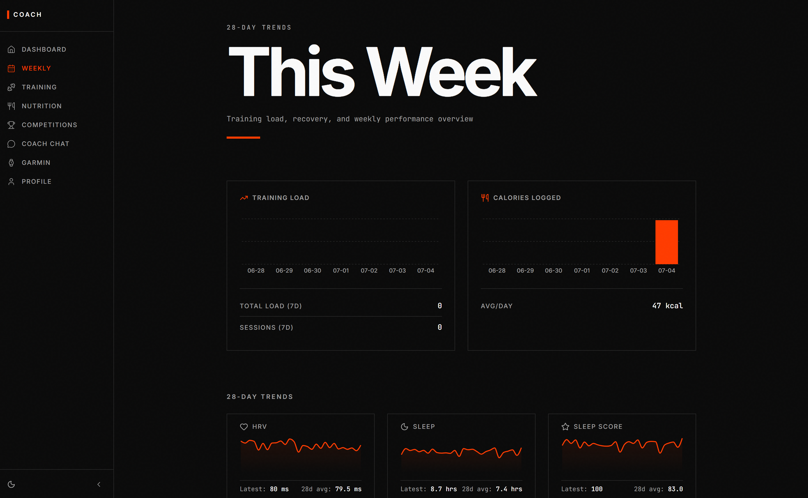
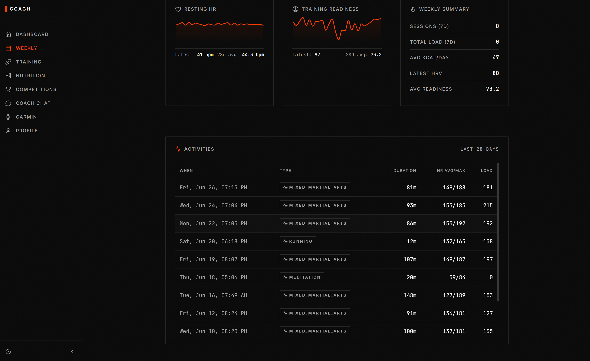

# Functionalities

A single-user fencing coach app. It syncs your Garmin data, works out
readiness, nutrition, and training automatically, and puts an AI coach on top.

> The numbers (readiness, targets, workouts) are calculated by fixed rules.
> The AI just interprets and explains them — it doesn't make them up.

---

## The AI coach

Chat with a coach that has access your garmin data — recent HRV, sleep, training
load, nutrition, upcoming competitions, and your goals.

It can also **take action** (use tools):

- Edit a day's gym workout (swap exercises, change sets/reps/load)
- Add a competition to your calendar

It searches the web only when you ask, and flags any number it cites that isn't
backed by your real data.

<!-- screenshot: coach chat -->

There are also smaller AI helpers for **meal macro estimates**, **meal plans**,
a **daily morning brief**, and **mental check-in insights**.

---

## What you can do

### Dashboard
Everything at a glance: readiness gauge, key stats (HRV, resting HR, sleep,
calories), the AI morning brief, next competition, and Garmin sync.

<!-- screenshot: dashboard -->

### Training
Weekly training split with gym prescriptions (sets × reps @ load), fencing
session analysis, and mental training check-ins.

<!-- screenshot: training -->

### Nutrition
Describe a meal and the AI estimates the macros — you confirm to save. Tracks
intake vs. daily targets, and generates meal plans and shopping lists.

<!-- screenshot: nutrition -->

### Competitions
Add and track competitions with dates, level, and priority. Upcoming events show
a countdown.

<!-- screenshot: competitions -->

### Weekly
28-day trends for training load, calories, HRV, sleep, and more.

<!-- screenshot: weekly trends -->

---

## Behind the scenes

- **Readiness** — from Garmin's training readiness score (red / amber / green).
- **Periodization** — training phase set by days to your next key competition.
- **Targets** — calories and macros periodized by day type and phase.
- **Workouts** — gym plans generated automatically, auto-deloaded on low readiness.
- **Background jobs** — Garmin sync every 15 min, a morning brief, and daily summaries.

See [README.md](./README.md) for the overview and [AGENTS.md](./AGENTS.md) for setup.
