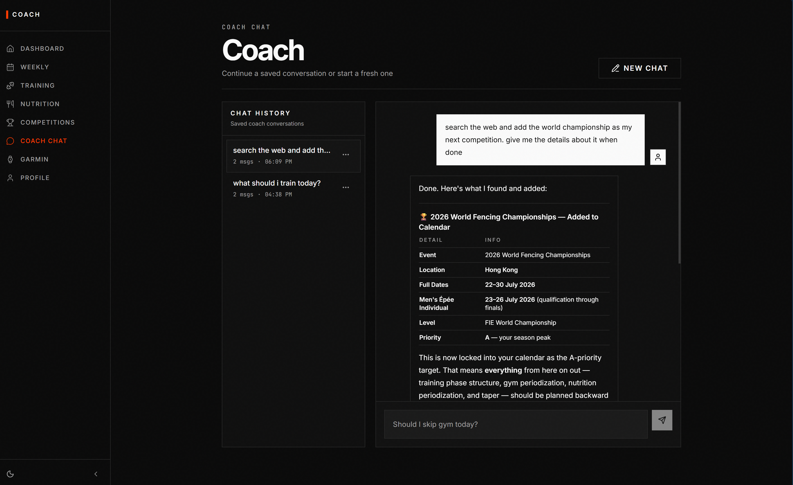
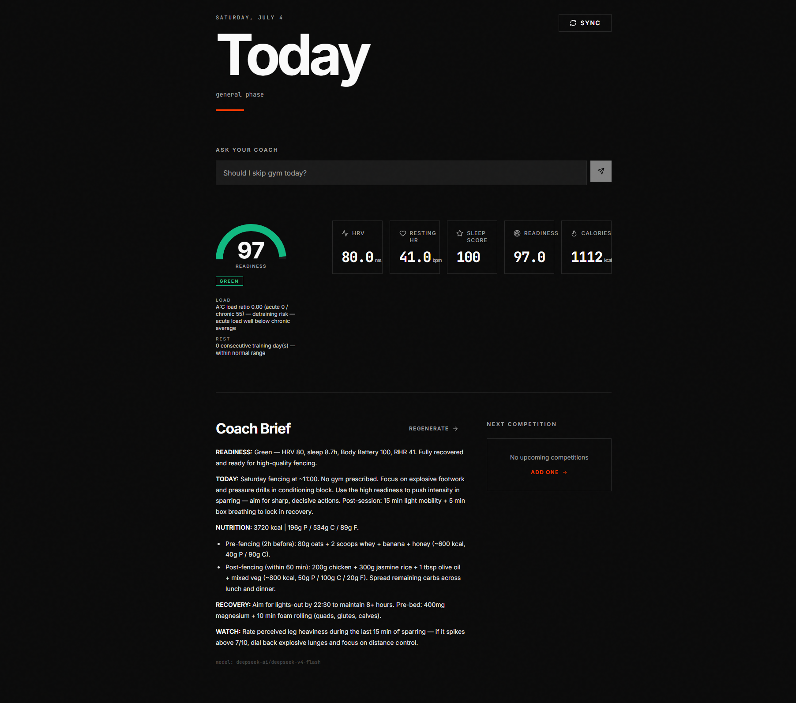
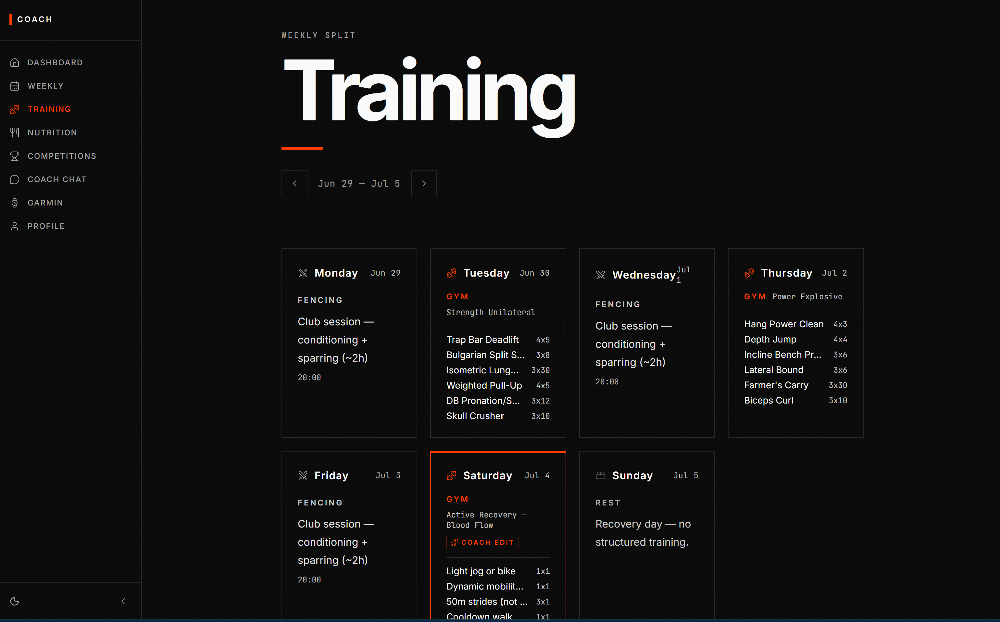
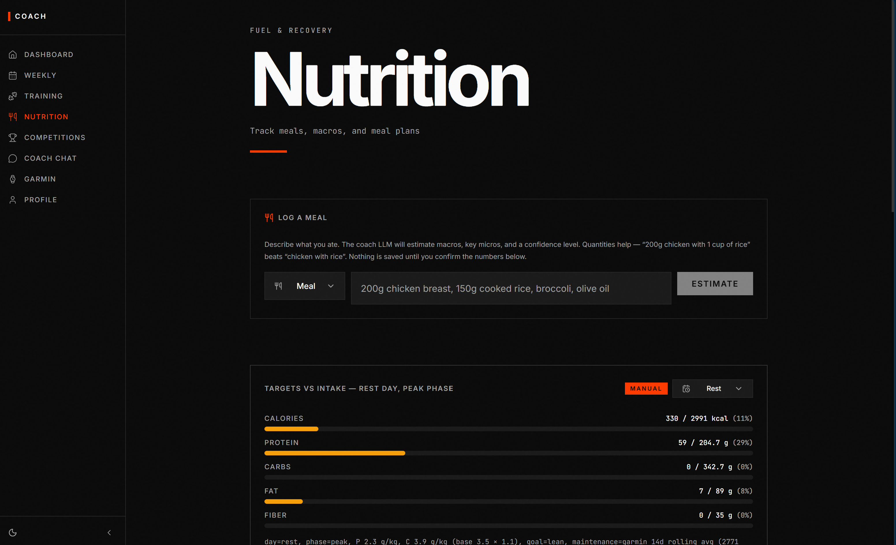
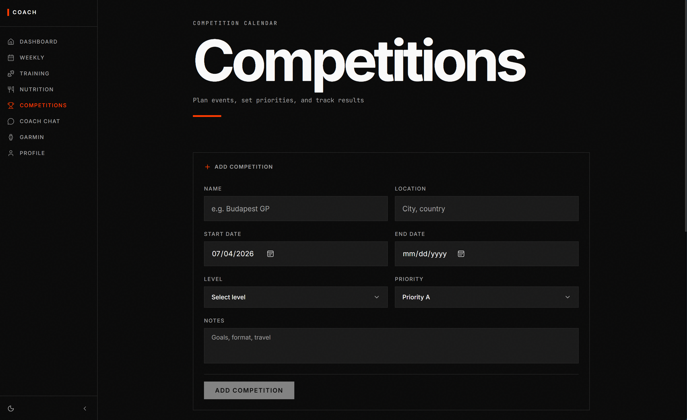
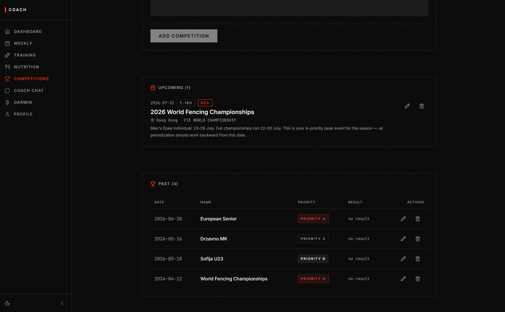
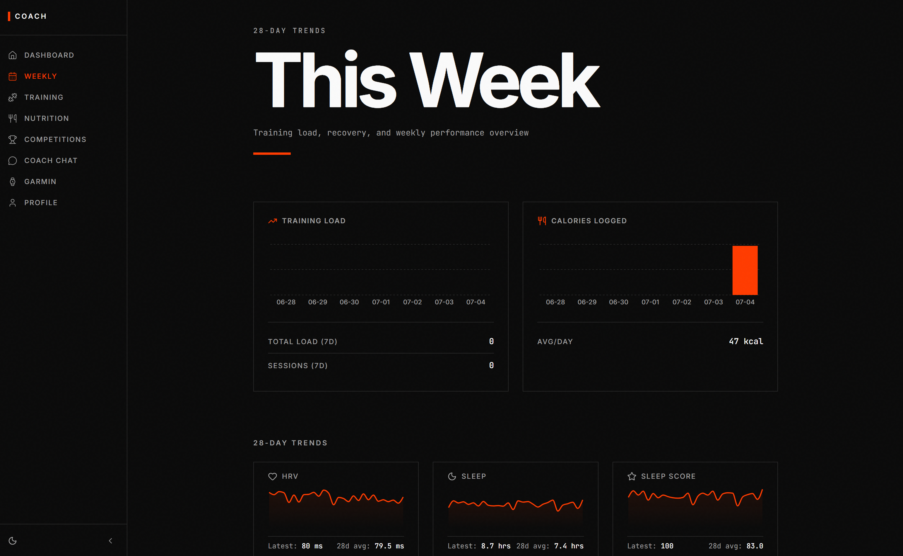
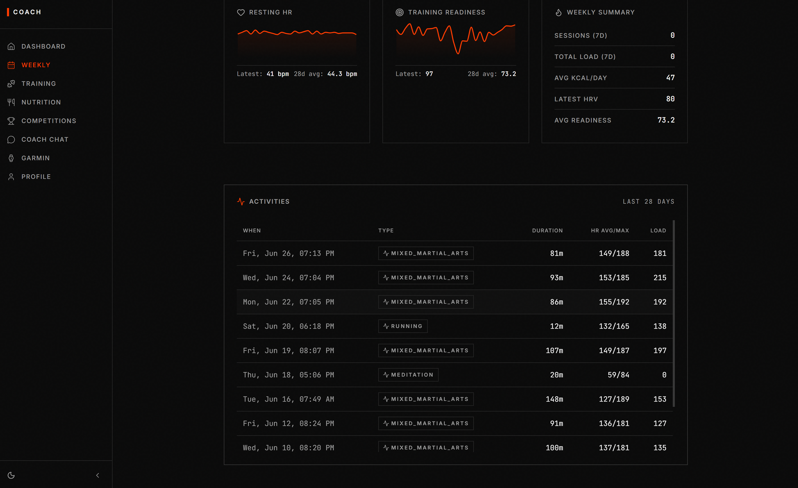

# Functionalities

A single-user fencing coach app. It syncs your Garmin data, works out
readiness, nutrition, and training automatically, and puts an AI coach on top.

> Readiness comes from Garmin; nutrition targets and default workouts use fixed
> rules. AI meal estimates are labelled and reviewed before saving, while saved
> food portions use the nutrition values you supplied.

---

## The AI coach

Chat with a coach that has access to your Garmin data — recent HRV, sleep, training
load, nutrition, upcoming competitions, and your goals.

It can also **take action** (use tools):

- Edit a day's gym workout (swap exercises, change sets/reps/load)
- Add a competition to your calendar
- Save foods with your supplied label values and log portions from your personal library
- Look up calorie and macro targets for specific dates, with links to the relevant diary or accepted plan
- Propose a competition nutrition plan with a comparison to current targets; apply it after review
- Remember context from chat, including explicit requests and supported food-preference inferences

Conversations are saved, and replies can continue generating while you leave the
page. You can inspect the context behind a reply. Web search is enabled when you
ask for a lookup, and the app flags potentially unsupported numerical claims.

**Coach actions** records changes, their before/after values, and the originating
conversation. Supported actions can be undone when the affected item has not
changed since; newer edits are protected.

**What my coach knows** lets you add, edit, confirm, or delete entries and disable memory.
Entries show their source, confirmation status, and optional expiry. Current
memories inform chat, briefs, and meal planning; profile dietary restrictions
remain authoritative. See [coach memory](./docs/coach-memory.md) for the rules
around inference, expiration, and undo.

<!-- screenshot: coach chat -->

There are also smaller AI helpers for **meal macro estimates**, **meal plans**,
a **daily morning brief**, and **mental check-in insights**.

---

## What you can do

### Dashboard

Everything at a glance: readiness gauge, key stats (HRV, resting HR, sleep,
calories), the AI morning brief, next competition, and Garmin sync. Freshness and
coverage indicators distinguish unavailable readings from real zero values.

<!-- screenshot: dashboard -->

### Training

Weekly training split with gym prescriptions (sets × reps @ load), fencing
session analysis, and mental training check-ins.

Ask the coach to change a date's session name, exercises, sets, reps, load, or
notes. The training plan labels those edits and lets you reset the date to its
calculated workout. Competition days also appear in the schedule. Fencing analysis
uses synced sessions, while mindset check-ins can be revisited, edited, or deleted
alongside AI insights.

<!-- screenshot: training -->

### Nutrition

Describe a meal and the AI estimates the macros — you confirm to save. Tracks
intake vs. daily targets, and generates meal plans and shopping lists.

The diary supports selected dates, manual macro entry, and editing or deleting
recorded meals. Targets show their source and respond to your goal, training day,
and competition phase; you can override the day type or return it to automatic.
Historical targets are recalculated with the current profile and rules.

**Voice logging** transcribes a recording into a draft you can inspect and correct.
Review food matches, portions, and nutrition before choosing to save a food or log
consumption. These are separate actions with receipts and guarded undo. Audio is
discarded after processing; see [voice logging](./docs/voice-logging.md) for provider
setup, supported formats, and limits.

**My foods** is a searchable personal library for products and homemade dishes.
Enter calories, macros, and any named micronutrient in g, mg, mcg, or IU per 100 g.
You can add a named serving with its gram weight, edit foods, or remove them.
Blank values stay unknown; incomplete foods can be saved, but calories, protein,
carbs, and fat are required to log them. Editing or removing a food preserves
past meal logs. Optional preparation times help constrain competition meal choices.
Micronutrient totals show known amounts and flag incomplete coverage.

You can also tell coach chat: “Save My yogurt: per 100 g, 62.3 kcal, 5.12 g protein,
4.1 g carbs, 2.03 g fat, 125 mg calcium; one pot is 150 g.” Saving does not log a meal.
Later, “I ate half a pot of My yogurt” logs it immediately using saved values.
The coach asks about ambiguous matches, quantities, or duplicate names. Nutrients
are never invented for library entries. The meal estimator uses saved values for
recognized foods and labels estimates for the remaining foods separately.

**Competition nutrition plans** cover the week before an event, its competition
days, and the following recovery day. Set expected demand and event format, then
compare dated targets before accepting. Overlapping events need an explicit
choice. Accepted versions are retained, changed inputs prompt review, and you can
deactivate a plan's current and future target assignments.

For an accepted target plan, generate meals for selected dates using saved foods
and cached USDA entries. Set start and break times, optionally limit preparation
time, and review the draft before accepting. Accepted meals can be replaced
individually through a new preview. Plans show ingredient
sources, totals, deviations from targets, and version history. Dietary exclusions
filter choices; preferences and budget guide selection, with actual prices left
unverified. Accepting a meal plan does not log food as eaten.

<!-- screenshot: nutrition -->

### Competitions

Add, edit, and track competitions with dates, location, level, and priority,
including events spanning several days. Upcoming and past events are separated;
upcoming events show a countdown and link to nutrition planning.

Record results with placing, field size, pool wins/losses, elimination outcome,
and a reflection. Results can be edited or cleared without deleting the event.

<!-- screenshot: competitions -->

### Weekly

The **Trends** page groups recovery, training, and nutrition. It combines a weekly
summary and seven-day load/intake charts with 28-day recovery trends and activity
history. Charts expose exact values, and missing data stays visible as gaps.

<!-- screenshot: weekly trends -->

### Garmin

Sync recent readings or request a full-history import, then inspect the last sync
attempt, outcome, and per-metric coverage. Partial syncs preserve usable readings
and identify unavailable endpoints; retry remains available. Freshness reflects
the underlying readings, so a successful sync does not imply every metric is current.

### Profile

Manage body measurements, fencing style, goals, weaknesses, supplements, and
nutrition preferences. Hard dietary restrictions are separate from soft food
preferences; budget influences suggestions without claiming verified prices.
Unsaved profile drafts can be recovered after leaving the page.

---

## Behind the scenes

- **Readiness** — from Garmin's training readiness score (red / amber / green).
- **Periodization** — training phase set by days to your next key competition.
- **Targets** — calories and macros periodized by day type and phase.
- **Workouts** — gym plans generated automatically, auto-deloaded on low readiness.
- **Athlete dates** — diaries and daily calculations use the configured athlete timezone.
- **Plan review** — accepted competition targets and meals retain versions; stale previews require a fresh comparison before applying.
- **Background jobs** — Garmin sync every 15 min by default, a morning brief, daily summaries, and persisted chat/estimate job status.
- **Model selection** — switch between configured Local and Cloud model pools; the choice persists, and cloud fallback tiers are configurable.

See [README.md](./README.md) for the overview and [AGENT_SETUP.md](./AGENT_SETUP.md) for setup.
