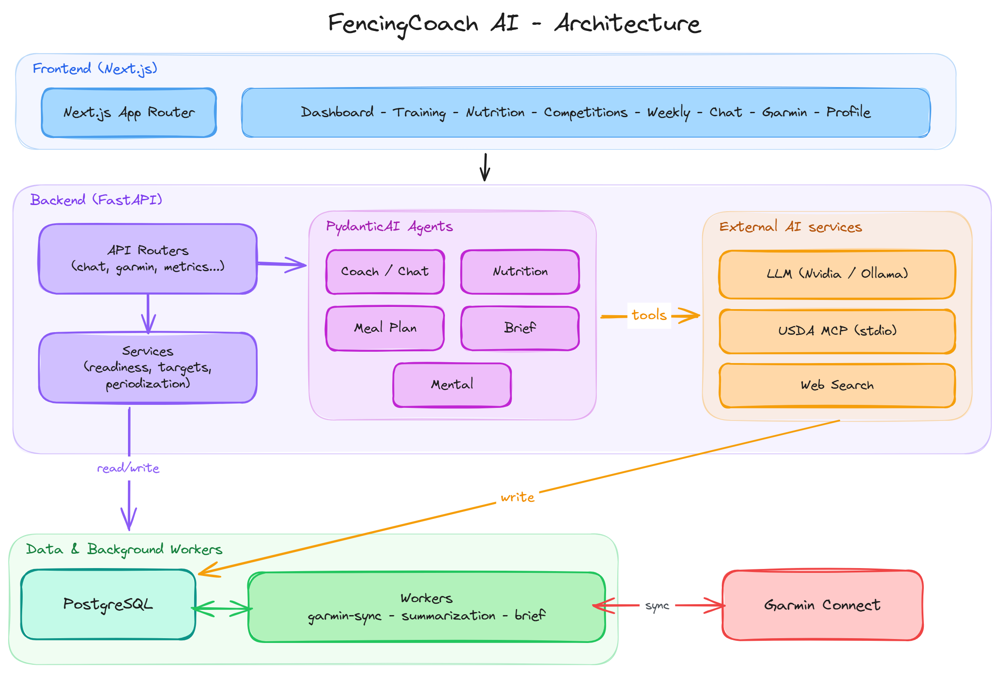

# FencingCoach AI

A personal coaching app for fencing. It helps with training plans, nutrition, competition preparation, Garmin sync, and chat-based check-ins.

The live version is hosted on my home server.

## What it includes

- Home dashboard: readiness overview, key metrics, next competition, quick coach chat, one-click Garmin sync
- Garmin data sync: recent and full-history imports, sync status, and data coverage
- Nutrition: daily diaries, food and recipe libraries, reviewed voice drafts, practical meal suggestions, meal plans, and shopping lists
- Training: daily workouts, coach edits, fencing session analysis, and mental check-ins
- Competitions: calendar, results, and reviewed nutrition and meal plans for preparation, event days, and recovery
- Coach chat: saved conversations, editable memory, dated nutrition answers, and action history with guarded undo
- Trends and profile: training, recovery, and nutrition summaries, athlete goals, dietary restrictions, and food preferences

See [FUNCTIONALITIES.md](./FUNCTIONALITIES.md) for a full breakdown of the coach
agent's capabilities and every app feature.

## Architecture

High-level overview of how the pieces fit together — a Next.js frontend talking
to a FastAPI backend, which fans out to PydanticAI agents, background workers, a
Postgres database, and external services (LLM, USDA MCP, Garmin Connect).



## Tech stack

- Frontend: Next.js
- Backend: FastAPI
- Database: PostgreSQL
- AI: PydanticAI agents with Ollama or another OpenAI-compatible model
- Sync: Garmin Connect integration for activity and health data

## Agent layer

- Shared `CoachDeps` keeps the DB session, live context snapshot, and extra runtime data in one place
- A cached OpenAI-compatible model factory is reused across agents
- Chat uses message history, live context injection, editable coach memory, and `WebSearch` for lookup support
- Coach tools record changes in an action history; competition nutrition proposals require review before applying
- Nutrition and meal-plan agents return structured Pydantic output and can call USDA MCP tools (local stdio subprocess, [rpassafaro/usda-api-mcp](https://github.com/rpassafaro/usda-api-mcp)) plus web search
- Brief and mental agents are text-only, but still use the same prompt and output cleanup flow

Chat replies and nutrition estimates have a **Cancel** control that terminates
the backend agent task and closes its upstream LLM stream, including while a job
is queued. Cancelled jobs cannot save a late result or start another retry.
Deleting a chat also cancels its pending replies. Actions already committed by
coach tools remain saved. Navigating away still lets a job finish.

Stopping inference on the provider itself requires it to honor stream
disconnects; the app cannot guarantee that behavior for every OpenAI-compatible
cloud service. For example, [llama.cpp binds streaming generation to its HTTP
connection by default](https://github.com/ggml-org/llama.cpp/blob/master/tools/server/README-dev.md).

## Run locally

```bash
cp .env.example .env
docker compose up -d --build
```

Then open:

- Frontend: `http://localhost:3000`
- API docs: `http://localhost:8000/docs`

See [AGENT_SETUP.md](./AGENT_SETUP.md) for a full setup/run guide (useful for coding agents or a fresh dev environment).

## Notes

- Single-user app with no authentication
- Set `GARMIN_EMAIL` and `GARMIN_PASSWORD` in `.env`
- If you use a remote model, set `LLM_BASE_URL` and `LLM_API_KEY`
- If you use Ollama, pull a model and set `LLM_MODEL` to match
- Voice transcription needs a separate `VOICE_TRANSCRIPTION_API_KEY`; see [voice logging](./docs/voice-logging.md) for configuration
